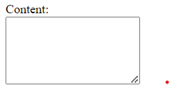

# Personal Homepage

On-going repo dari tugas [TIK2032-project-php-mysql](https://github.com/yeftakun/TIK2032-project-php-mysql.git)

Page: [yeftakun.my.id](http://yeftakun.my.id)

<a href="https://youtu.be/QtdbGIvLJKo?si=uFrV_p2AISCH4A52">Tutorial Deploy AWS</a>

Dynamic page: [blog.php](page\blog.php) & [blogcontent.php](page\blog-list\blogcontent.php)

### Database

```
Name DB: myblog

categories:
+--------------------------------------------------------------------+
| category_id | int(11)      | NO   | PRI | NULL    | auto_increment |
| name        | varchar(255) | NO   |     | NULL    |                |
+--------------------------------------------------------------------+

posts:
+-------------------------------------------------------------------------+
| post_id      | int(11)      | NO   | PRI | NULL        | auto_increment |
| title        | varchar(255) | NO   |     | NULL        |                |
| content      | text         | NO   |     | NULL        |                |
| author       | varchar(100) | NO   |     | NULL        |                |
| publish_date | date         | NO   |     | NULL        |                |
| image_path   | varchar(255) | NO   |     | default.png |                |
| source_link  | varchar(255) | YES  |     | NULL        |                |
| category_id  | int(11)      | YES  | MUL | NULL        |                |
+-------------------------------------------------------------------------+

visitor_count:
+---------------------------------------------------------+
| id    | int(11) | NO   | PRI | NULL    | auto_increment |
| COUNT | int(11) | YES  |     | 0       |                |
+---------------------------------------------------------+

password:
+----------------------------------------------------+
| id    | int(11)     | NO   | PRI | NULL    |       |
| pass  | varchar(12) | YES  |     | NULL    |       |
+----------------------------------------------------+
update password set pass='password_baru123';
```

### Add Blog
<ul>
<li>Buat blog baru di <a href="ignorethis\add-blog.php">add-blog.php</a> (<a href="http://localhost/personal-homepage/ignorethis/add-blog.php">localhost/personal-homepage/ignorethis/add-blog.php</a>).
<li>Untuk bagian <strong>content</strong> buat dengan struktur html (header mulai h2)</li>
</ul>



<ul>
<li>Ukuran file tidak lebih dari 500KB</li>
<ul>
